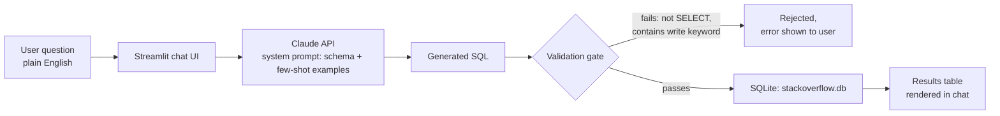

# System Architecture

## 🎯 What this is

A natural-language query interface over a normalized StackOverflow database:
type a plain-English question, get back the generated SQL and a results
table. The interesting engineering is in the middle layer — schema-grounded
prompting, few-shot examples pulled from a hand-validated query suite, and a
safety-validation gate — not just "call the API."

---

## 🔄 Request Flow



**Components**:
1. **Streamlit chat UI** ([`app/app.py`](../app/app.py)) — session-state chat history, renders generated SQL + result tables per turn.
2. **NLP layer** ([`src/nlp_layer.py`](../src/nlp_layer.py)) — `generate_sql()` calls Claude with a system prompt containing the full schema DDL, column notes (e.g. `parent_id` semantics, `is_accepted` meaning), and 4 few-shot examples drawn from the validated 15-query suite.
3. **Validation gate** (`validate_and_execute()`) — rejects anything that isn't a `SELECT`/`WITH` statement, or that contains a write/schema keyword (`DROP`, `DELETE`, `UPDATE`, `INSERT`, `ALTER`, `ATTACH`, `PRAGMA`, `REPLACE`) as a substring anywhere in the query, before it ever reaches SQLite.
4. **SQLite database** ([`src/build_db.py`](../src/build_db.py)) — 7 normalized tables, 10 indexes (see below) tuned for the query patterns in the validated suite.

---

## 🛠️ Tech Stack

| Layer | Choice | Why |
|---|---|---|
| Database | SQLite | Single-file, zero-ops, fine for a read-heavy analytical workload at this scale |
| Data acquisition | BigQuery public dataset via Kaggle Notebook | No local GCP billing setup; Kaggle notebooks get free BigQuery query access |
| LLM | Claude (`claude-sonnet-5`) | Schema-grounded text-to-SQL |
| App | Streamlit | Fast to ship a chat-style interface with dataframe rendering built in |
| Data movement | pandas + pyarrow | CSV/parquet agnostic loader |

---

## 🔒 Safety Model

The validation gate is a **substring/prefix blocklist**, not a full SQL
parser — it is a practical guard against an LLM emitting an obviously
destructive statement, not a defense against a deliberately adversarial user
crafting SQL to evade the blocklist (e.g. obfuscated keywords). Two mitigating
factors:
1. SQLite's Python driver here is opened read/write on a local file with no
   other consumers — worst case is corrupting a local, regenerable database.
2. This is a portfolio/demo app, not a multi-tenant service with untrusted
   input reaching the LLM prompt.

For a production deployment, the next step up would be a dedicated SQL
parser (e.g. `sqlglot`) that inspects the parsed statement type rather than
scanning for keyword substrings, plus a read-only database connection/user.

---

## 📇 Indexing Strategy

10 indexes ([`src/add_indexes.py`](../src/add_indexes.py)), chosen to match
the join/filter columns used across the 15-query suite:

| Index | Supports |
|---|---|
| `posts_questions(creation_date)` | Date-range filters, "recent questions", YoY growth |
| `posts_questions(user_id)` | User → their questions |
| `posts_answers(parent_id)` | Question → its answers (the most common join) |
| `posts_answers(user_id)` | User → their answers, acceptance-rate queries |
| `posts_answers(creation_date)` | Time-to-first-answer queries |
| `post_tags(tag_id)` | Tag → questions (tag volume, tag co-occurrence) |
| `comments(post_id)` | Post → its comments |
| `comments(user_id)` | User → their comments |
| `votes(post_id)` | Post → its votes |
| `users(reputation)` | Reputation ranking/filtering |

---

## 📦 Data Movement

```
Kaggle Notebook (BigQuery client, free tier)
    ↓ CSV export, scoped by date + curated tags
data/*.csv  (git-ignored — not committed, acquisition scripts are)
    ↓ src/build_db.py
stackoverflow.db (SQLite, git-ignored)
    ↓ src/add_indexes.py
indexed, query-ready database
```

The repo ships the **acquisition scripts and export queries**, not the raw
data or the built database — anyone cloning the repo re-runs the export
themselves against the public dataset.
