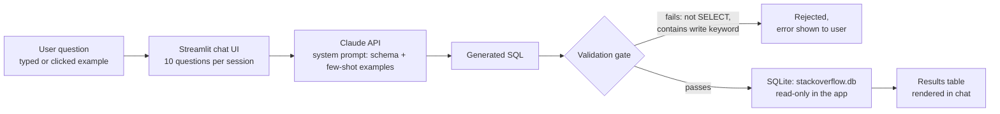

# System Architecture

## 🎯 What this is

A natural-language query interface over a normalized StackOverflow database:
type a plain-English question, get back the generated SQL and a results
table. The interesting engineering is in the middle layer — schema-grounded
prompting, few-shot examples pulled from a hand-validated query suite, and a
safety-validation gate — not just "call the API."

---

## 🔄 Request Flow


```mermaid
flowchart LR
    A[User question<br/>typed or clicked example] --> B[Streamlit chat UI<br/>10 questions per session]
    B --> C[Claude API<br/>system prompt: schema + few-shot examples]
    C --> D[Generated SQL]
    D --> E{Validation gate}
    E -- fails: not SELECT,<br/>contains write keyword --> F[Rejected,<br/>error shown to user]
    E -- passes --> G[SQLite: stackoverflow.db<br/>read-only in the app]
    G --> H[Results table<br/>rendered in chat]
```

**Components**:
1. **Streamlit chat UI** ([`app/app.py`](../app/app.py)) — session-state chat history, renders generated SQL + result tables per turn. Shows 7 random questions from a pool of 35 as clickable buttons (Shuffle for another 7), and stops accepting questions after 10 per session to limit API spend.
2. **NLP layer** ([`src/nlp_layer.py`](../src/nlp_layer.py)) — `generate_sql()` calls Claude with a system prompt containing the full schema DDL, column notes (e.g. `parent_id` semantics, `is_accepted` meaning) — a column list per table, not full DDL —, and 4 few-shot examples drawn from the 15-query suite. The prompt also states the data's date range (so "last month" means relative to 2022-09-25, not today) and that YoY comparisons should use complete years.
3. **Validation gate** (`validate_and_execute()`) — rejects anything that isn't a `SELECT`/`WITH` statement, or that contains a write/schema keyword (`DROP`, `DELETE`, `UPDATE`, `INSERT`, `ALTER`, `ATTACH`, `PRAGMA`, `REPLACE`) as a substring anywhere in the query, before it ever reaches SQLite. Because it is substring matching, it also rejects harmless queries that merely contain one of those words (for example SQLite's `REPLACE()` function).
4. **SQLite database** ([`src/build_db.py`](../src/build_db.py)) — 7 normalized tables, 10 indexes (see below) tuned for the query patterns in the validated suite.

---

## 🛠️ Tech Stack

| Layer | Choice | Why |
|---|---|---|
| Database | SQLite | Single-file, zero-ops, fine for a read-heavy analytical workload at this scale |
| Data acquisition | BigQuery public dataset via Kaggle Notebook | No local GCP billing setup; Kaggle notebooks get free BigQuery query access |
| LLM | Claude (`claude-sonnet-5`) | Schema-grounded text-to-SQL |
| App | Streamlit | Fast to ship a chat-style interface with dataframe rendering built in |
| Data movement | pandas | CSV loader (also reads parquet if `pyarrow` is installed) |
| Hosting | Render (free tier) | Builds from `render.yaml`; database fetched from a GitHub Release at build time |

---

## 🔒 Safety Model

The validation gate is a **substring/prefix blocklist**, not a full SQL
parser — it is a practical guard against an LLM emitting an obviously
destructive statement, not a defense against a deliberately adversarial user
crafting SQL to evade the blocklist (e.g. obfuscated keywords). Two mitigating
factors:
1. The Streamlit app opens the database **read-only** (`mode=ro`), so even a
   query that slipped past the blocklist could not modify it. The command-line
   scripts (`nlp_layer.py`, `test_nlp_questions.py`) still open it read/write,
   against a local, regenerable file.
2. This is a portfolio/demo app, not a multi-tenant service. Because the app
   is public, the main exposure is API spend rather than data: sessions are
   capped at 10 questions, but the cap resets on page refresh, so a spend limit
   on the API key is the real backstop.

For a production deployment, the next step up would be a dedicated SQL
parser (e.g. `sqlglot`) that inspects the parsed statement type rather than
scanning for keyword substrings, plus per-user rate limiting.

---

## 📇 Indexing Strategy

10 indexes ([`src/add_indexes.py`](../src/add_indexes.py)), chosen to match
the join/filter columns used across the 15-query suite:

| Index | Supports |
|---|---|
| `posts_questions(creation_date)` | Date-range filters, "recent questions", YoY growth |
| `posts_questions(user_id)` | User → their questions |
| `posts_answers(parent_id)` | Question → its answers (the most common join) |
| `posts_answers(user_id)` | User → their answers, acceptance-rate queries |
| `posts_answers(creation_date)` | Time-to-first-answer queries |
| `post_tags(tag_id)` | Tag → questions (tag volume, tag co-occurrence) |
| `comments(post_id)` | Post → its comments |
| `comments(user_id)` | User → their comments |
| `votes(post_id)` | Post → its votes |
| `users(reputation)` | Reputation ranking/filtering |

---

## 📦 Data Movement

```
Kaggle Notebook (BigQuery client, free tier)
    ↓ data/kaggle_export.py — curated tags, 1-in-16 sample
data/*.csv  (git-ignored)
    ↓ src/build_db.py   (creates the schema, then appends rows)
    ↓ src/add_indexes.py
stackoverflow.db (SQLite, git-ignored, ~480 MB)
    ↓ gzip, uploaded as GitHub Release asset data-v1 (~175 MB)
Render build: src/download_db.py fetches and unpacks it
```

The repo ships the export script and the loader, not the raw CSVs or the
database; the database is published separately as a release asset. Anyone can
either rebuild it from BigQuery or run `src/download_db.py`.
