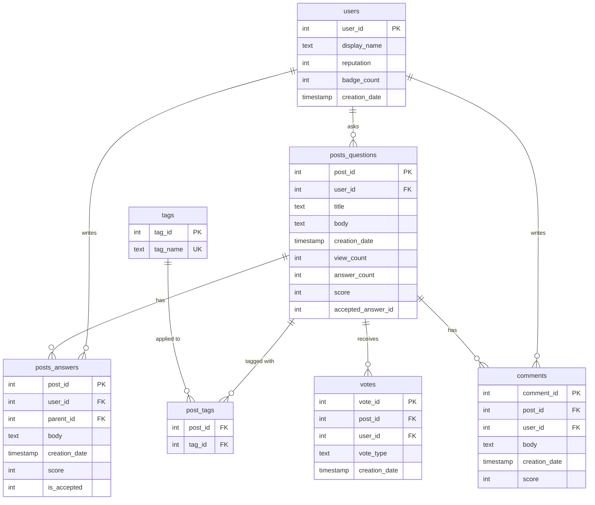

# Data Schema

## 📋 Source

**Source**: `bigquery-public-data.stackoverflow` (Google BigQuery public dataset,
mirrored from the official [Stack Exchange Data Dump](https://archive.org/details/stackexchange))
**Access path**: Kaggle Notebook with the "Stack Overflow" BigQuery dataset attached
(free tier, no local GCP setup) — see [`data/kaggle_export_queries.sql`](../data/kaggle_export_queries.sql)
**Scope**: `creation_date` between 2020-01-01 and 2025-12-31, restricted to a curated
list of ~35 popular tags (see below) to keep the export a manageable size for a
local SQLite database rather than the full multi-million-row table.
**Row counts**: pending — filled in after the real export is loaded (see
[README status](../README.md#status)).

---

## 🗺️ Entity-Relationship Diagram



---

## 📐 Table Definitions

### `users`
| Column | Type | Notes |
|---|---|---|
| `user_id` | INTEGER PK | |
| `display_name` | TEXT NOT NULL | |
| `reputation` | INTEGER | |
| `badge_count` | INTEGER | Real count from the `badges` table, grouped by user (not a proxy) |
| `creation_date` | TIMESTAMP NOT NULL | |

**Scoping**: only users who own at least one question or answer in the filtered
set are pulled — not the full 20M+ row `users` table.

### `tags`
| Column | Type | Notes |
|---|---|---|
| `tag_id` | INTEGER PK | |
| `tag_name` | TEXT UNIQUE NOT NULL | |

Pulled in full (~64K rows, small table) so tag lookups work even for tags
outside the curated export list.

### `posts_questions`
| Column | Type | Notes |
|---|---|---|
| `post_id` | INTEGER PK | |
| `user_id` | INTEGER NOT NULL, FK → `users` | |
| `title` | TEXT NOT NULL | |
| `body` | TEXT | |
| `creation_date` | TIMESTAMP NOT NULL | |
| `view_count` | INTEGER | |
| `answer_count` | INTEGER | |
| `score` | INTEGER | |
| `accepted_answer_id` | INTEGER | NULL if unanswered/unaccepted |

### `posts_answers`
| Column | Type | Notes |
|---|---|---|
| `post_id` | INTEGER PK | |
| `user_id` | INTEGER NOT NULL, FK → `users` | |
| `parent_id` | INTEGER NOT NULL, FK → `posts_questions.post_id` | |
| `body` | TEXT | |
| `creation_date` | TIMESTAMP NOT NULL | |
| `score` | INTEGER | |
| `is_accepted` | INTEGER (0/1) | Derived: `1` if `posts_answers.post_id == posts_questions.accepted_answer_id` |

### `post_tags` (many-to-many join)
| Column | Type | Notes |
|---|---|---|
| `post_id` | INTEGER FK → `posts_questions` | |
| `tag_id` | INTEGER FK → `tags` | |

Not queried directly from BigQuery — derived locally by
[`src/build_db.py`](../src/build_db.py) from the pipe-delimited `tags` column
included in the `posts_questions` export (e.g. `"python|pandas|dataframe"`),
resolved against `tags.tag_name`.

### `comments`
| Column | Type | Notes |
|---|---|---|
| `comment_id` | INTEGER PK | |
| `post_id` | INTEGER NOT NULL, FK → `posts_questions` | References a question **or** answer post_id |
| `user_id` | INTEGER NOT NULL, FK → `users` | |
| `body` | TEXT NOT NULL | |
| `creation_date` | TIMESTAMP NOT NULL | |
| `score` | INTEGER | |

### `votes`
| Column | Type | Notes |
|---|---|---|
| `vote_id` | INTEGER PK | |
| `post_id` | INTEGER NOT NULL, FK → `posts_questions` | |
| `user_id` | INTEGER, **nullable** | See caveat below |
| `vote_type` | TEXT NOT NULL | `UpMod`, `DownMod`, `Favorite`, `AcceptedByOriginator`, `Close`, `Reopen`, `BountyStart`, `BountyClose` |
| `creation_date` | TIMESTAMP NOT NULL | |

**⚠️ Anonymization caveat**: the official Stack Exchange data dump anonymizes
voters — `bigquery-public-data.stackoverflow.votes` has no `user_id` column at
all. Our schema keeps `votes.user_id` as a nullable column (the reference spec
originally had it `NOT NULL`) so vote *counts and types per post* remain
queryable, but "which user cast this vote" is not answerable from real data.

---

## 🏷️ Curated Tag Scope

To keep a local SQLite database a reasonable size while staying thematically
rich enough to demo the NLP layer well, the export is restricted to ~35
popular tags rather than the full StackOverflow tag space:

```
python, javascript, java, sql, reactjs, typescript, docker, kubernetes,
amazon-web-services, pandas, numpy, django, flask, node.js, c++, c#, go,
rust, sqlite, postgresql, mysql, git, html, css, linux, bash, regex, api,
rest, graphql, machine-learning, tensorflow, pytorch, scikit-learn, nlp,
streamlit, pytest, algorithm
```

Adjustable via `TAG_REGEX` in [`data/kaggle_export_queries.sql`](../data/kaggle_export_queries.sql).

---

## 🔗 License note on the underlying data

Stack Exchange content (questions, answers, comments) is licensed
[CC BY-SA 4.0](https://creativecommons.org/licenses/by-sa/4.0/) — see
[`docs/CITATIONS.md`](CITATIONS.md).
