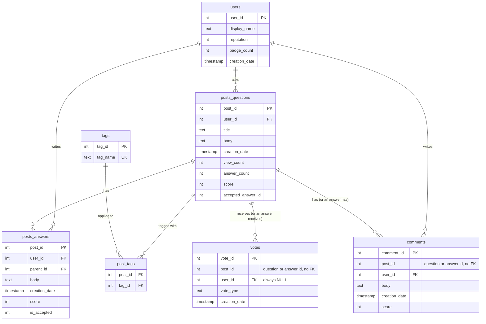

# Data Schema

## 📋 Source

**Source**: `bigquery-public-data.stackoverflow` (Google BigQuery public dataset,
mirrored from the official [Stack Exchange Data Dump](https://archive.org/details/stackexchange))
**Access path**: Kaggle Notebook with the "Stack Overflow" BigQuery dataset attached
(free tier, no local GCP setup) — see [`data/kaggle_export.py`](../data/kaggle_export.py)
**Scope**: questions with at least one of 38 curated tags (see below), sampled
**1-in-16** by post id. The tag filter alone matches ~2.8M questions, too large
for a local SQLite file. The export asks for 2020–2025, but the public BigQuery
mirror ends on **2022-09-25**, so that is where the data stops (first question
2020-01-01). Answers, comments, votes and authors follow the sampled questions;
question and answer bodies are truncated to 500 characters.

**Row counts (as loaded):**

| Table | Rows |
|---|---|
| `users` | 227,026 |
| `tags` | 63,653 |
| `posts_questions` | 174,131 |
| `posts_answers` | 186,018 |
| `post_tags` | 561,396 |
| `comments` | 572,119 |
| `votes` | 487,387 |

---

## 🗺️ Entity-Relationship Diagram


```mermaid
erDiagram
    users ||--o{ posts_questions : "asks"
    users ||--o{ posts_answers : "writes"
    users ||--o{ comments : "writes"
    posts_questions ||--o{ posts_answers : "has"
    posts_questions ||--o{ post_tags : "tagged with"
    tags ||--o{ post_tags : "applied to"
    posts_questions ||--o{ comments : "has (or an answer has)"
    posts_questions ||--o{ votes : "receives (or an answer receives)"

    users {
        int user_id PK
        text display_name
        int reputation
        int badge_count
        timestamp creation_date
    }
    tags {
        int tag_id PK
        text tag_name UK
    }
    posts_questions {
        int post_id PK
        int user_id FK
        text title
        text body
        timestamp creation_date
        int view_count
        int answer_count
        int score
        int accepted_answer_id
    }
    posts_answers {
        int post_id PK
        int user_id FK
        int parent_id FK
        text body
        timestamp creation_date
        int score
        int is_accepted
    }
    post_tags {
        int post_id FK
        int tag_id FK
    }
    comments {
        int comment_id PK
        int post_id "question or answer id, no FK"
        int user_id FK
        text body
        timestamp creation_date
        int score
    }
    votes {
        int vote_id PK
        int post_id "question or answer id, no FK"
        int user_id FK "always NULL"
        text vote_type
        timestamp creation_date
    }
```

---

## 📐 Table Definitions

### `users`
| Column | Type | Notes |
|---|---|---|
| `user_id` | INTEGER PK | |
| `display_name` | TEXT NOT NULL | |
| `reputation` | INTEGER | |
| `badge_count` | INTEGER | Real count from the `badges` table, grouped by user (not a proxy) |
| `creation_date` | TIMESTAMP NOT NULL | |

**Scoping**: only users who wrote at least one sampled question, answer or
comment are loaded — not the full multi-million-row `users` table. (Including
comment authors is what makes every `comments.user_id` foreign key resolve.)

### `tags`
| Column | Type | Notes |
|---|---|---|
| `tag_id` | INTEGER PK | |
| `tag_name` | TEXT UNIQUE NOT NULL | |

Loaded in full (63,653 rows) rather than only the curated tags, because a
question's other tags are kept. About 19.6K distinct tags are actually used by
at least one loaded question. Two real tags are literally named `null` and
`nan` — see [`DATA_QUIRKS.md`](DATA_QUIRKS.md).

### `posts_questions`
| Column | Type | Notes |
|---|---|---|
| `post_id` | INTEGER PK | |
| `user_id` | INTEGER NOT NULL, FK → `users` | |
| `title` | TEXT NOT NULL | |
| `body` | TEXT | Truncated to 500 characters |
| `creation_date` | TIMESTAMP NOT NULL | |
| `view_count` | INTEGER | |
| `answer_count` | INTEGER | |
| `score` | INTEGER | |
| `accepted_answer_id` | INTEGER | NULL if unanswered/unaccepted |

### `posts_answers`
| Column | Type | Notes |
|---|---|---|
| `post_id` | INTEGER PK | |
| `user_id` | INTEGER NOT NULL, FK → `users` | |
| `parent_id` | INTEGER NOT NULL, FK → `posts_questions.post_id` | |
| `body` | TEXT | Truncated to 500 characters |
| `creation_date` | TIMESTAMP NOT NULL | |
| `score` | INTEGER | |
| `is_accepted` | INTEGER (0/1) | Derived: `1` if `posts_answers.post_id == posts_questions.accepted_answer_id` |

### `post_tags` (many-to-many join)
| Column | Type | Notes |
|---|---|---|
| `post_id` | INTEGER FK → `posts_questions` | |
| `tag_id` | INTEGER FK → `tags` | |

Not queried directly from BigQuery — derived locally by
[`src/build_db.py`](../src/build_db.py) from the pipe-delimited `tags` column
included in the `posts_questions` export (e.g. `"python|pandas|dataframe"`),
resolved against `tags.tag_name`.

### `comments`
| Column | Type | Notes |
|---|---|---|
| `comment_id` | INTEGER PK | |
| `post_id` | INTEGER NOT NULL | A question **or** an answer id, so there is no foreign key (365,999 comments are on questions, 206,120 on answers) |
| `user_id` | INTEGER NOT NULL, FK → `users` | |
| `body` | TEXT NOT NULL | |
| `creation_date` | TIMESTAMP NOT NULL | |
| `score` | INTEGER | |

### `votes`
| Column | Type | Notes |
|---|---|---|
| `vote_id` | INTEGER PK | |
| `post_id` | INTEGER NOT NULL | A question **or** an answer id, so there is no foreign key (283,979 of the votes are on answers) |
| `user_id` | INTEGER, **nullable** | Always NULL in this data — see caveat below |
| `vote_type` | TEXT NOT NULL | Decoded for `UpMod` (320,917), `AcceptedByOriginator` (70,904), `DownMod` (53,899), `Favorite` (17,992), `BountyStart`, `BountyClose`. Other codes were not decoded and load as numeric strings: `16` (14,504), `11` (3,468), `15` (1,088), `10` (1,088) |
| `creation_date` | TIMESTAMP NOT NULL | |

**⚠️ Anonymization caveat**: the public `bigquery-public-data.stackoverflow.votes`
table has no voter column at all (the reason was not confirmed against Stack
Exchange documentation; it is consistent with the data dump anonymizing voters). The schema
keeps `votes.user_id` as a nullable column — the original project spec had it
`NOT NULL` — and it is NULL for every row. Vote *counts and types per post* are
queryable; "which user cast this vote" is not.

---

## 🏷️ Curated Tag Scope

To stay thematically focused, the export keeps only questions carrying at least
one of these 38 popular tags (their other tags are kept too). Together with the
1-in-16 sample this keeps the database a manageable size:

```
python, javascript, java, sql, reactjs, typescript, docker, kubernetes,
amazon-web-services, pandas, numpy, django, flask, node.js, c++, c#, go,
rust, sqlite, postgresql, mysql, git, html, css, linux, bash, regex, api,
rest, graphql, machine-learning, tensorflow, pytorch, scikit-learn, nlp,
streamlit, pytest, algorithm
```

Adjustable via `TAG_REGEX` and `SAMPLE_MOD` in [`data/kaggle_export.py`](../data/kaggle_export.py).

---

## 🔗 License note on the underlying data

Stack Exchange content (questions, answers, comments) is licensed
[CC BY-SA 4.0](https://creativecommons.org/licenses/by-sa/4.0/). The database
published as a release asset contains truncated post bodies, titles and
comments, so it carries that license — see [`CITATIONS.md`](CITATIONS.md).
